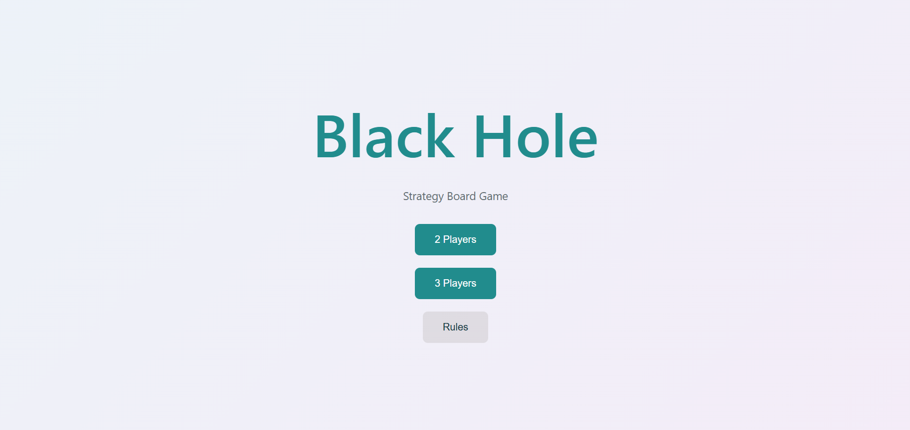
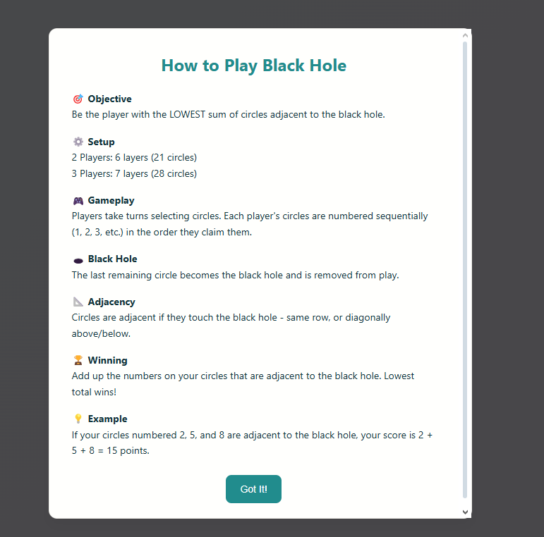
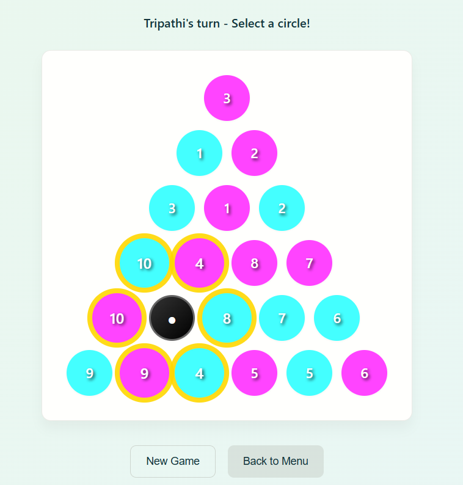
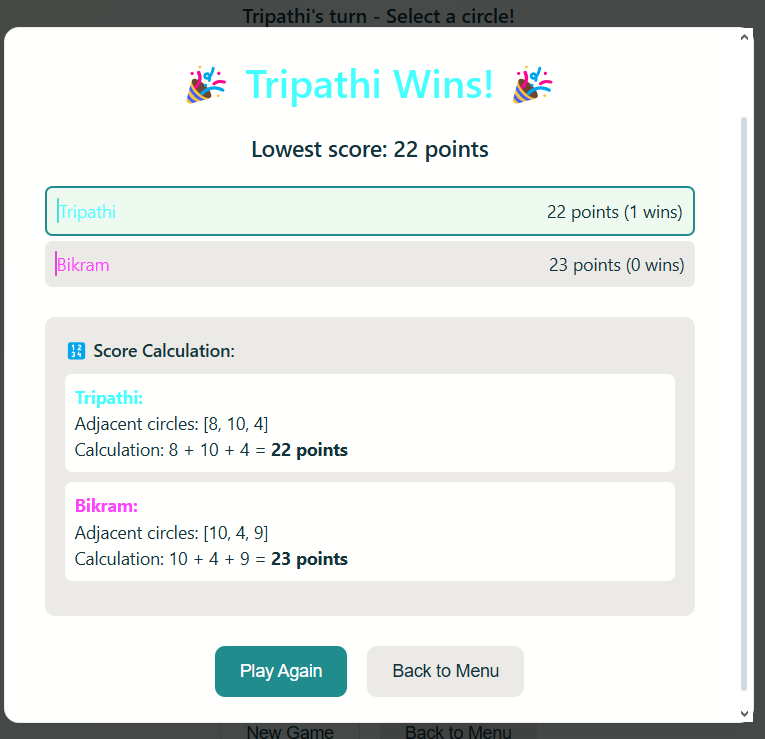

# 🎮 Black Hole – Strategy Board Game

## 📌 Overview
**Black Hole** is a browser-based **strategy board game** built with **vanilla JavaScript, HTML, and CSS**.  
The game is designed for **2–3 players** and focuses on **logical thinking and tactical moves**.  

I created this project as part of my portfolio to demonstrate:  
✨ Frontend development skills  
✨ Interactive UI design  
✨ Game logic implementation  
✨ Modular and scalable JavaScript coding  

---

## 🕹️ How the Game Works

### 🎯 Objective  
Be the player with the **lowest sum of circles adjacent to the Black Hole**.

### ⚙️ Setup  
👥 **2 Players** → 6 layers (21 circles)  
👥 **3 Players** → 7 layers (28 circles)  

### 🎮 Gameplay  
1️⃣ Players take turns selecting circles.  
2️⃣ Each circle a player claims is **numbered sequentially** (1, 2, 3, …).  
3️⃣ The **last remaining circle** becomes the **Black Hole**.  

### 🕳️ Black Hole  
- The Black Hole is removed from play.  
- All **adjacent circles** (same row, diagonally above/below) are counted.  

### 🏆 Winning  
- Add up the numbers on your claimed circles adjacent to the Black Hole.  
- **Lowest total wins**.  

### 💡 Example  
If your claimed circles `2`, `5`, and `8` are adjacent to the Black Hole → your score = **15 points**.

---

## ✨ Features
✅ Interactive UI with clean design  
✅ 2–3 player support  
✅ Dynamic board generation  
✅ Player customization (names + colors)  
✅ Turn-based logic with current turn indicator  
✅ Winner calculation with breakdown modal  
✅ Rules modal for instructions  
✅ Responsive design (desktop + mobile)  
✅ Light/Dark theme ready  

---

## 🛠️ Tech Stack & Concepts

| Technology | Usage |
|------------|--------|
| **HTML5**  | Game structure & UI screens |
| **CSS3**   | Styling, responsive design, animations, modals |
| **JavaScript (Vanilla ES6)** | Core game logic & interactivity |

### Key Concepts  
- 🖼️ **DOM Manipulation** → Dynamic board creation, circle claiming, modals  
- 🎲 **Game State Management** → Tracking players, turns, board, scores  
- 🖱️ **Event Listeners** → Handling clicks for circles, buttons, and modals  
- 📺 **Screen Management** → Switching between menu, setup, and game  
- 📐 **Adjacency Logic** → Detecting which circles count towards final score  
- 🏆 **Modal Windows** → Winner announcement & rules explanation  
- 📱 **Responsive UI** → Works across devices  

---

## 📂 Project Structure
```
📁 BlackHole-Game
├── index.html      # Game layout, UI screens, modals
├── style.css       # Styling, colors, responsiveness
├── app.js          # Game logic, state management, event handling
└── README.md       # Project documentation
```

---

## 🚀 Getting Started

### 1️⃣ Clone the Repository
```bash
git clone https://github.com/yourusername/blackhole-game.git
cd blackhole-game
```

### 2️⃣ Run the Game
Simply open `index.html` in your browser 🌐  

---

## 📸 Screenshots

| Main Menu | Rules Modal | Gameplay | Winner Screen |
|-----------|-------------|----------|---------------|
|  |  |  |  |

---

## 🎯 Why This Project?
I built this game to:  
- Practice **frontend development** (HTML, CSS, JS).  
- Showcase **problem-solving** with adjacency + turn-based logic.  
- Demonstrate **UI/UX design skills** (menus, modals, responsiveness).  
- Add an **interactive project** to my portfolio that recruiters can try instantly.  

---

## 📌 Future Improvements
✨ AI/bot player for single-player mode  
✨ Online multiplayer support  
✨ More themes & animations  
✨ Score history & leaderboard  

---

## 👨‍💻 Author
**Bikram Tripathi**

[](https://portfolio-website-yap5.onrender.com/)
[](https://github.com/Funza07)
[](https://www.linkedin.com/in/bikram-tripathi-cse/)

---

⚡ *"From pixels to algorithms — building the future, one project at a time."*
